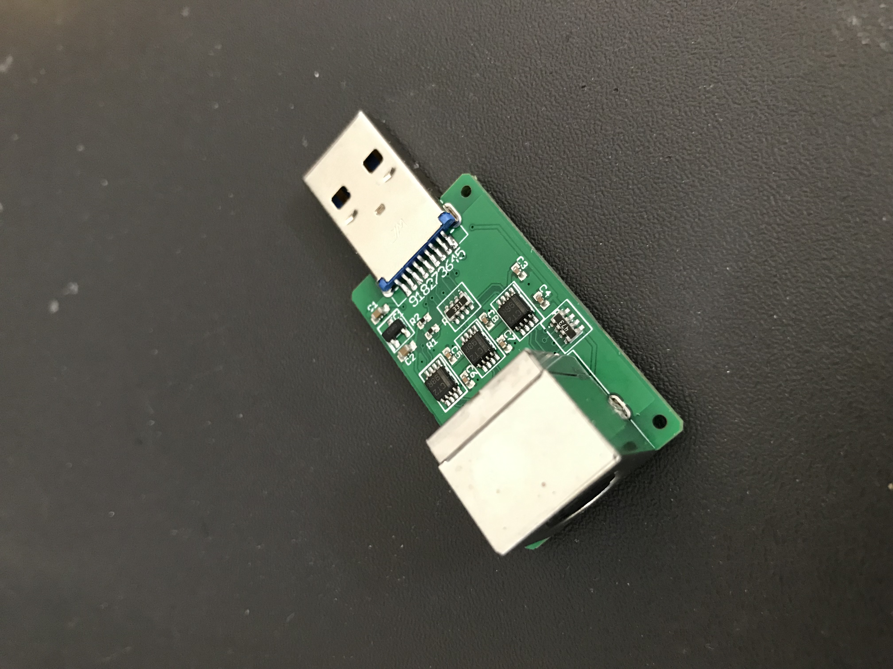

# MiSTer_PCE-SNAC converter board

This is a board designed to work with the MiSTer FPGA system, and is originally based on
the SNAC designs from blue212 at https://github.com/blue212/SNAC

The PC Engine controller system has higher-speed requirements than most other systems, and
as a result, the regular open-collector SNAC boards don't really work for most situations
(ie. auto-fire, 6-button controller, turbotap, PCE mouse, Memory Base 128, etc.).  This is
because the rise time on the pulses is not fast enough among other things.  This board
was designed to address these issues.

While designing it, I also felt that I wanted as small a board as possible, so I decided
to integrate the regular "surfboard" SNAC and the adapter, integrating them into a single
device.  I also shrunk all the components as much as possible, and chose easily-obtainable
parts so that I could get them assembled by JLCPCB's SMT assembly service at a very good
price.  (However they don't mount connectors.)

I designed the board using the free version of EAGLE (2-layer, less than 100mm on both
X- and Y-axes).  The gerbers are included in this repository, including the files required
by JLCPCB's SMT assembly forms, in case you want to get your own set made.

The board measures 37mm x 22mm (plus USB plug).  Here is a picture:

